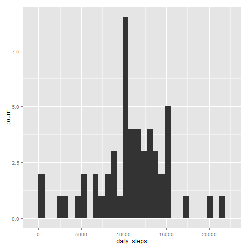
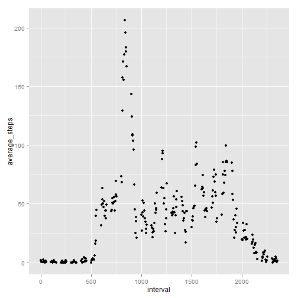
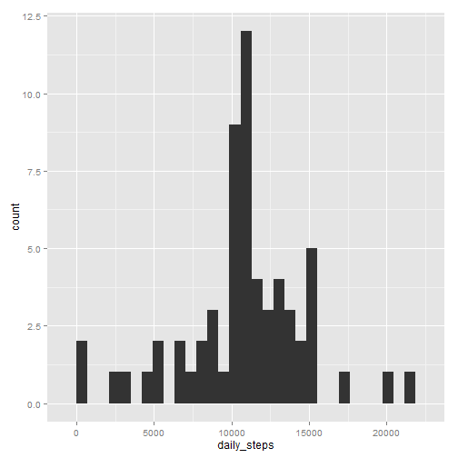
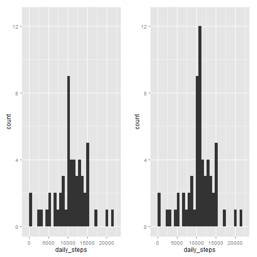
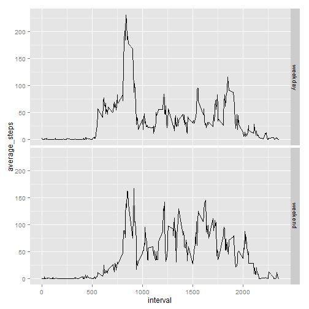

---
title: "Peer Assessment 1"
author: "Prateek Jain"
date: "Wednesday, April 15, 2015"
output: html_document
---

## Peer Assessment 1 (Reproducible Research, Coursera.com)

Downloading the zip file and extracting contents works in the console this way:

temp <- tempfile();
download.file("https://d396qusza40orc.cloudfront.net/repdata%2Fdata%2Factivity.zip", temp);
data <- read.csv(unz(temp,"activity.csv"));
unlink(temp);

However, Markdown format doesn't support file download with my computer's security settings, so assume the data is present in the current directory. Loading the data as follows:

### Accessing and pre-processing raw data

```r
setwd("D:/Projects/DataSciencesCoursera/R/course5_reproducibility/Assignment1")
data <- read.csv("activity.csv", stringsAsFactors=FALSE)
str(data)
```

```
## 'data.frame':	17568 obs. of  3 variables:
##  $ steps   : int  NA NA NA NA NA NA NA NA NA NA ...
##  $ date    : chr  "2012-10-01" "2012-10-01" "2012-10-01" "2012-10-01" ...
##  $ interval: int  0 5 10 15 20 25 30 35 40 45 ...
```

### Total Number of steps taken per day
1) Calculate the total number of steps taken per day.
2) Make a histogram of the total number of steps taken each day.
3) Calculate and report the mean and median of the total number of steps taken per day

We will use the plyr package to calculate these values and ggplot2 package to plot them.


```r
library(plyr)
d <- ddply(data, .(date), function(df) sum(df$steps))
names(d) <- c("date", "daily_steps")
#daytype[i] <- if(i %in% weekend) {"weekend"} else {"weekday"}

library(ggplot2)
p1 <- qplot(data =d,daily_steps , type ="hist")
print(p1)
```

```
## stat_bin: binwidth defaulted to range/30. Use 'binwidth = x' to adjust this.
```

 

```r
mean = mean(d$daily_steps, na.rm = TRUE)
print("Average number of steps taken daily:", quote = FALSE) ; mean
```

```
## [1] Average number of steps taken daily:
```

```
## [1] 10766.19
```

```r
median = median(d$daily_steps, na.rm = TRUE)
print("Median number of steps taken daily:", quote = FALSE); median
```

```
## [1] Median number of steps taken daily:
```

```
## [1] 10765
```

### Average Daily Activity Pattern
1) Plot a time series plot of the 5-minute interval average and number of steps taken.
2) Then find the interval which contains the max number of steps on average.


```r
ave <- ddply(data, .(interval), function(df) { mean(df$steps, na.rm = TRUE)})
names(ave) <- c("interval", "average_steps")
qplot(data =ave, x= interval, y =average_steps , type ="l")
```

 

```r
max_ave = ave[which.max(ave$average_steps),1]

print("The interval containing the max number of steps on average is interval:") ; max_ave
```

```
## [1] "The interval containing the max number of steps on average is interval:"
```

```
## [1] 835
```

### Imputing missing values
1) Calculate and report the total number of missing values in the dataset.
2) Devise a strategy for filling in all of the missing values in the dataset. 

<i>  I'm going to fill each row with the integer value of the average number of steps in that interval. <i>

3) Create a new dataset that is equal to the original dataset but with the missing data filled in.
4) Make a histogram of the total number of steps taken each day and Calculate and report the mean and median total number of steps taken per day. Do these values differ from the estimates from the first part of the assignment? What is the impact of imputing missing data on the estimates of the total daily number of steps?

<i>   Illustrating the imapact of imputing the missing values via the two histograms plotted side by side, using the gridExtra package.
  Notice that the total number of steps seems to increase for certain days but the distribution doesn't change in shape, only magnitude. </i>


```r
print("Total Rows with missing values") ; sum(is.na(data$steps))
```

```
## [1] "Total Rows with missing values"
```

```
## [1] 2304
```

```r
data2 <- data
for (i in 1:nrow(data2)) {  
  if(is.na(data2[i,1])) {data2[i,1] = as.integer(ave[ave$interval == data2[i,3],2])}
}
str(data2)
```

```
## 'data.frame':	17568 obs. of  3 variables:
##  $ steps   : int  1 0 0 0 0 2 0 0 0 1 ...
##  $ date    : chr  "2012-10-01" "2012-10-01" "2012-10-01" "2012-10-01" ...
##  $ interval: int  0 5 10 15 20 25 30 35 40 45 ...
```

```r
d2 <- ddply(data2, .(date), function(df) sum(df$steps))
names(d2) <- c("date", "daily_steps")
#daytype[i] <- if(i %in% weekend) {"weekend"} else {"weekday"}

library(ggplot2)
p2 <- qplot(data =d2,daily_steps , type ="hist")
print(p2)
```

```
## stat_bin: binwidth defaulted to range/30. Use 'binwidth = x' to adjust this.
```

 

```r
mean2 = mean(d2$daily_steps, na.rm = TRUE)
print("Average number of steps taken daily:", quote = FALSE) ; mean2
```

```
## [1] Average number of steps taken daily:
```

```
## [1] 10749.77
```

```r
median2 = median(d2$daily_steps, na.rm = TRUE)
print("Median number of steps taken daily:", quote = FALSE); median2
```

```
## [1] Median number of steps taken daily:
```

```
## [1] 10641
```

```r
p1 <- p1 + ylim(0,12.5)
p2 <- p2 + ylim(0,12.5)

library(gridExtra)
grid.arrange(p1,p2,ncol = 2)
```

```
## stat_bin: binwidth defaulted to range/30. Use 'binwidth = x' to adjust this.
## stat_bin: binwidth defaulted to range/30. Use 'binwidth = x' to adjust this.
```

 

### Are there differences in activity patterns between weekdays and weekends?


```r
weekend <- c("Saturday", "Sunday")
data3 <- data2

data3 <- transform (data3, days =weekdays(as.Date(data[,2])))
data3$days <- as.character(data3$days)
data3 <- transform(data3, daytype = "")
data3$daytype <- as.character(data3$daytype)
for (i in 1:nrow(data3)) {  
  if((data3[i,4] == "Saturday" | data3[i,4] == "Sunday" )) {
    data3[i,5] = "weekend"
  } else {data3[i,5] = "weekday"
  }
  
}
data3$daytype <- as.factor(data3$daytype)
data3 <- data3[,c(1,2,3,5)]
str(data3)
```

```
## 'data.frame':	17568 obs. of  4 variables:
##  $ steps   : int  1 0 0 0 0 2 0 0 0 1 ...
##  $ date    : chr  "2012-10-01" "2012-10-01" "2012-10-01" "2012-10-01" ...
##  $ interval: int  0 5 10 15 20 25 30 35 40 45 ...
##  $ daytype : Factor w/ 2 levels "weekday","weekend": 1 1 1 1 1 1 1 1 1 1 ...
```

```r
ave2 <- ddply(data3, .(daytype,interval), function(df) { average_steps = mean(df$steps, na.rm = TRUE)})
names(ave2) <- c("daytype", "interval", "average_steps")
p4 <- ggplot(data =ave2, aes (x= interval, y =average_steps)) +geom_line() + 
               facet_grid(daytype~.)
             
print(p4)
```

 
